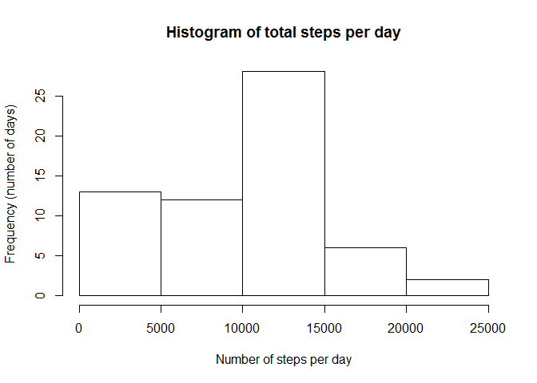
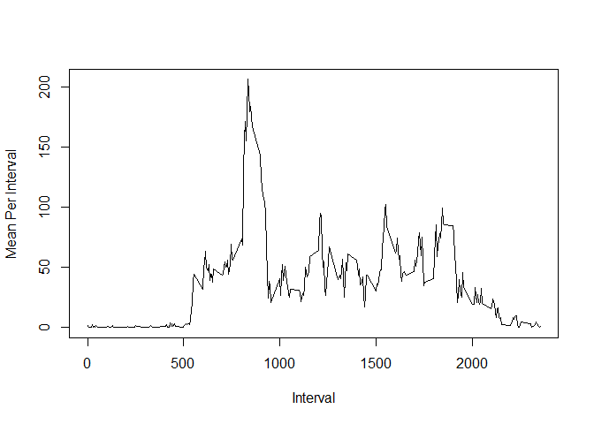
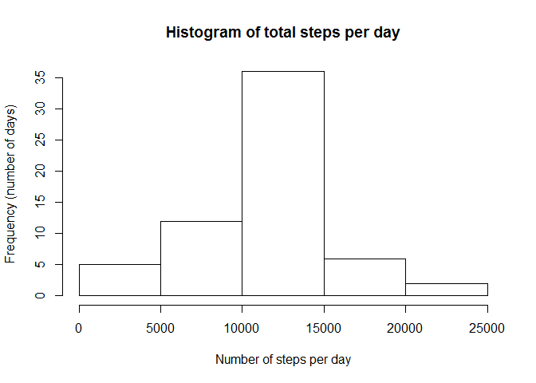
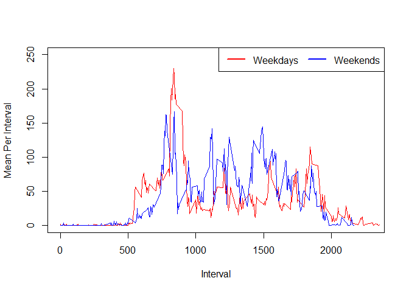

# Reproducible Research: Peer Assessment 1


## Loading and preprocessing the data

```r
data = read.csv(unz("activity.zip", filename = "activity.csv"), colClasses = c(NA, "Date", NA))
head(data)
```

```
##   steps       date interval
## 1    NA 2012-10-01        0
## 2    NA 2012-10-01        5
## 3    NA 2012-10-01       10
## 4    NA 2012-10-01       15
## 5    NA 2012-10-01       20
## 6    NA 2012-10-01       25
```


## What are the mean and total number of steps taken per day?

```r
totalSteps = aggregate(list(Sum = data$steps), list(Date = data$date), sum, na.rm = TRUE)
hist(as.numeric(totalSteps$Sum), main = "Histogram of total steps per day", xlab = "Number of steps per day", ylab = "Frequency (number of days)")
```

 

```r
mean = mean(totalSteps$Sum)
median = median(totalSteps$Sum)
```

The mean of the total number of steps taken per day is 9354.2295082 and the median is 10395.

## What is the average daily activity pattern?

```r
meanPerDay = aggregate(list("Mean Per Day" = data$steps), list(Interval = data$interval), mean, na.rm = TRUE)
plot(meanPerDay, type = "l", xlab = "Interval", ylab = "Mean Per Interval")
```

 

```r
maxInterval = meanPerDay$Interval[which.max(meanPerDay$Mean.Per.Day)]
```

The five-minute interval containing the maximum value is the interval 835.

## Imputing missing values

```r
numNA = sum(sapply(data, is.na))
```
The total number of missing values in the dataset is 2304.  
One strategy for substituting missing values is using the mean of steps in the same interval:


```r
data[is.na(data$steps), "steps"] <- meanPerDay[match(data[is.na(data$steps), "interval"], meanPerDay$Interval), "Mean.Per.Day"]
totalSteps2 = aggregate(list(Sum = data$steps), list(Date = data$date), sum, na.rm = TRUE)
hist(as.numeric(totalSteps2$Sum), main = "Histogram of total steps per day", xlab = "Number of steps per day", ylab = "Frequency (number of days)")
```

 

```r
mean2 = mean(totalSteps2$Sum)
median2 = median(totalSteps2$Sum)
```

The mean of the total number of steps taken per day for the imputed dataset is 10766.1886792 and the median is 10766.1886792.

## Are there differences in activity patterns between weekdays and weekends?

```r
data$DayType <- factor(c("weekday", "weekend")[format(data$date, "%u") %in% c(6, 7) + 1L])
dataWeekend <- data[data$DayType == "weekend",]
dataWeekday <- data[data$DayType == "weekday",]
meanPerDayWeekend = aggregate(list("Mean Per Day" = dataWeekend$steps), list(Interval = dataWeekend$interval), mean)
meanPerDayWeekday = aggregate(list("Mean Per Day" = dataWeekday$steps), list(Interval = dataWeekday$interval), mean)

plot(meanPerDayWeekday, type = "l", col = "red", ylim=c(0.0,250.0), xlim=c(0.0,2300.0), xlab = "Interval", ylab = "Mean Per Interval")
par(new=TRUE)
plot(meanPerDayWeekend, type = "l", col = "blue", ylim=c(0.0,250.0), xlim=c(0.0,2500.0), xlab = "", ylab = "", axes = FALSE)
legend("topright", 
       c("Weekdays","Weekends"), 
       horiz=TRUE,
       lty=c(1,1), 
       lwd=c(2,2), 
       col=c("red","blue"))
```

 
